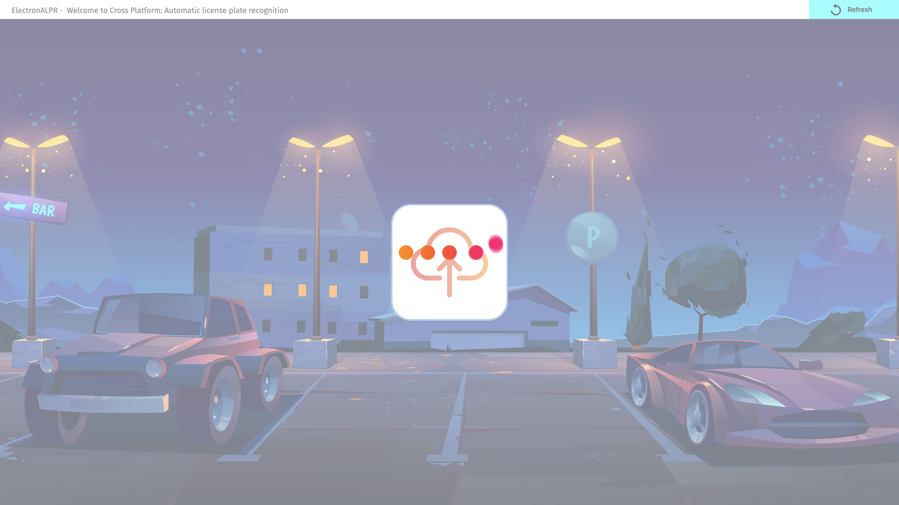
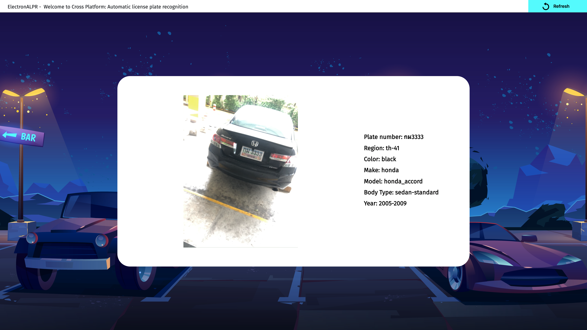

# ElectronALPR

Cross Platform: Automatic license plate recognition

## Getting start

1. Install .Net Core 3.1 SDK & Node.js
2. Register an [OpenALPR](https://www.openalpr.com/) account and replace your registered API KEY in HomeController
3. Go to the project directory and run "dotnet restore && dotnet build"
4. Start the project to run in browser
5. To run as Electron .Net Core you must [Install ElectronNET CLI](https://github.com/ElectronNET/Electron.NET)
6. For macOS to build an app, run "electronize build /target osx"
7. Use your own images or the assets from Car Images folder

## Demo

